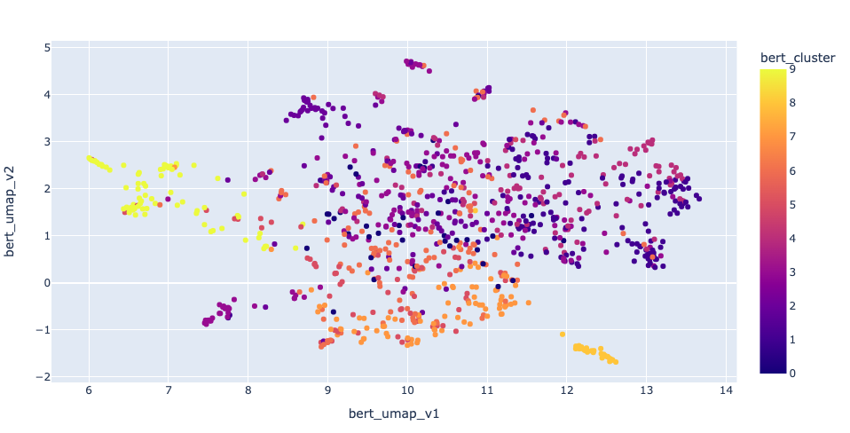
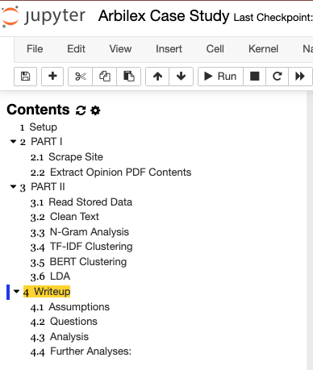

# arbilex_case_study



# Files & Folders
Below are the relevant files and their description:
- `Arbilex Case Study.ipynb`
    - This file contains all the code used to perform the exercise. It also includes displays of relevant visuals and the "Writeup" section at the end contains my analysis and discussion of results. It contains 4 main sections. 
        1. STEUP is just imports
        2. PART I of the exercise, including scraping and text content extraction
        3. PART II, which includes cleaning the text data, N-gram analysis, TF-IDF clustering, and BERT clustering (didn't have time for LDA).
        4. WRITEUP as described above.<br>
- `output_files/`
    - Originally, this folder contained every one of the scraped opinion PDFs, saved as JSONs: `opinion_<case_number>.json`. I was having some issues uploading to Github, so I instead chose a subset of documents. I assumed that would be okay, but let me know if you do wat to see all files (1000 total). This folder does include a file called `all_opinions.json` that has all the contents from those 1000 documents. There is also a csv files, `all_opinions.csv`, containing the data stored as I performed the exercise, for easy saving and loading.
- `output_files_test/`
    - This folder contains the same documents as `output_files/` but for a subset of the data. I set up the `Arbilex Case Study.ipynb` file so you can run it and all data will be saved here, but it will load data from `output_files/`. That way you can run the notebook from beginning to end without having to wait too long for it to finish.
- `images/`
    - You can ignore this one. It's just images for this README file.
- `PDFs/`
    - Also can be ignored. This folder holds temporary PDF files as they are downloaded to be OCRed.



# Running the Exercise
To run this exercise you simply need to run the `Arbilex Case Study.ipynb` file from an IPython service. The notebook is set up to compute using partial data at every step to speed things up, but when it loads data it loads the actual full set of data, which I pre-ran. It requires several dependencies, which are all found in the  `requirements.txt` file. It's a messy requirements file as I didn't have time to clean it, but it should be complete. You most likely know this well, but one way to set up the environment is:
```
conda create -n <environment_name> python=3.8
conda activate
pip install -r requirements.txt
```

If you have any questions, please don't hesitate to contact me :)
